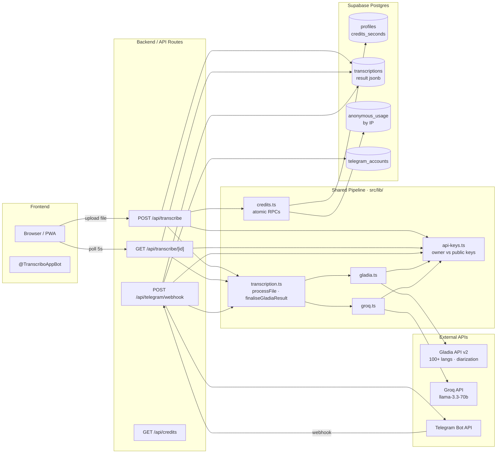

# Transcribo — AI Transcription & Speaker Diarization

A full-stack PWA that transcribes audio and video files with automatic speaker detection and AI-generated summaries. Available as a web app and a Telegram bot — both share the same backend, credit system, and transcription history.

**Live demo:** https://transcribe.om-dev.uk · **Telegram:** @TranscriboAppBot

[](https://uncleom.github.io/transcribe-app/)


---

## Features

- **Transcription** — upload any audio or video file; Gladia API v2 handles 100+ languages with speaker diarization
- **Speaker diarization** — automatically splits transcript by speaker (Speaker 1, Speaker 2, …)
- **AI summary** — Groq (Llama 3.3 70B) generates a structured summary in the transcript's language
- **On-demand translation** — regenerate summary or full transcript in EN / ES / PT / RU with a single click
- **Two view modes** — clean text or timestamped transcript with speaker labels
- **Transcription history** — authenticated users see all past jobs across web and Telegram
- **Credit system** — anonymous users get 3 min free (by IP); registered users get 20 min on signup; atomically tracked in Postgres
- **Installable PWA** — works offline shell, install prompt on Android and iOS guidance banner
- **Google OAuth** — one-click sign-in via Supabase Auth
- **Telegram bot** — forward any voice message or audio file directly to @TranscriboAppBot and get the transcript in the chat; linked to the same account and credits as the web app

---

## Tech Stack

| Layer | Technology |
|---|---|
| Framework | Next.js 16 (App Router), TypeScript |
| Styling | Tailwind CSS v4 |
| Auth & DB | Supabase (Postgres + RLS + Storage) |
| Transcription | Gladia API v2 (diarization, 100+ languages) |
| Summarization / Translation | Groq API — Llama 3.3 70B Versatile |
| PWA | next-pwa 5.6 + Workbox service worker |
| Telegram Bot | Telegram Bot API (webhook, inline keyboards) |
| Deployment | Hetzner VPS + Coolify (self-hosted CI/CD) |

---

## Architecture

> **[→ Open interactive architecture graph](https://uncleom.github.io/transcribe-app/)** — clickable nodes, flow highlighting, step-by-step breakdown



**Key design decisions:**

- Files go directly from the browser to Gladia — Supabase Storage is not used as a relay, reducing latency and egress costs.
- Credit reservation happens before the Gladia job starts; adjustment (actual duration) happens after completion. Both are atomic Postgres RPCs to prevent double-spending under concurrent uploads.
- The transcription pipeline lives in `src/lib/transcription.ts` — shared by both the web API routes and the Telegram bot. Adding a new client (mobile app, Slack bot, etc.) means calling the same `processFile()` function.
- Telegram bot is a second frontend to the same service — it shares accounts, credits, and history with the web app. Account linking happens via one-time tokens generated on the website.
- Server Components are the default; Client Components only where interactivity is required (upload zone, polling, Telegram link button).
- `next build --webpack` is required (not Turbopack) — next-pwa 5.6 uses Webpack plugins to generate the service worker.

The UI is in English. The architecture is ready for localization (es-AR and pt-BR were the original target markets) — adding `next-intl` would be a straightforward next step.

---

## Getting Started

```bash
git clone https://github.com/uncleom/transcribe-app
cd transcribe-app
npm install
cp .env.example .env.local   # fill in your keys
npm run dev
```

Requires Node 20+.

### Environment Variables

See `.env.example` for the full list. Required:

| Variable | Description |
|---|---|
| `NEXT_PUBLIC_SUPABASE_URL` | Supabase project URL |
| `NEXT_PUBLIC_SUPABASE_ANON_KEY` | Supabase anon key |
| `SUPABASE_SERVICE_ROLE_KEY` | Service role key (API routes only) |
| `GLADIA_API_KEY` | Gladia v2 API key |
| `GROQ_API_KEY` | Groq API key |
| `TELEGRAM_BOT_TOKEN` | From @BotFather |
| `TELEGRAM_SECRET_TOKEN` | Random secret for webhook validation (`openssl rand -hex 32`) |

### Database

Apply migrations from `supabase/migrations/` to your Supabase project. The schema includes RLS policies and Postgres RPCs for atomic credit operations.

After deploying, register the Telegram webhook:
```bash
curl -X POST "https://api.telegram.org/bot<TOKEN>/setWebhook" \
  -d "url=https://your-domain.com/api/telegram/webhook&secret_token=<SECRET>"
```

---

## Project Structure

```
src/
├── app/                        Next.js App Router pages and API routes
│   ├── api/transcribe/         Upload handler + status polling + summary endpoint
│   ├── api/telegram/           Webhook handler + account linking API
│   ├── connect-telegram/       Account linking page
│   ├── history/                Transcription history (protected)
│   └── transcription/          Result viewer with tabs
├── components/                 UI components (UploadZone, InstallBanner, TelegramLinkButton, …)
└── lib/                        Business logic
    ├── transcription.ts        Shared pipeline: normalise + summarise + format
    ├── gladia.ts               Gladia API client
    ├── groq.ts                 Groq summarisation + translation
    ├── credits.ts              Atomic credit operations
    └── telegram.ts             Telegram Bot API client
```
