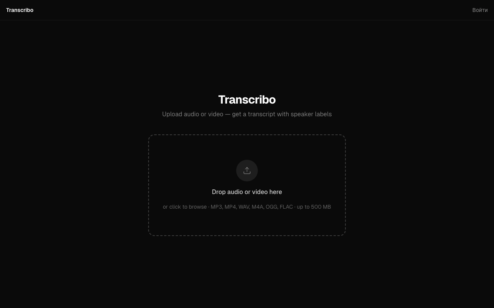

# Transcribo — AI Transcription & Speaker Diarization

A full-stack PWA that transcribes audio and video files with automatic speaker detection and AI-generated summaries. Built as a production-ready SaaS with a credit-based monetization model.

**Live demo:** https://transcribe.om-dev.uk



---

## Features

- **Transcription** — upload any audio or video file; Gladia API v2 handles 100+ languages with word-level timestamps
- **Speaker diarization** — automatically splits transcript by speaker (Speaker 1, Speaker 2, …)
- **AI summary** — Groq (Llama 3.3 70B) generates a structured summary alongside the full transcript
- **Two view modes** — clean text or timestamped transcript with speaker labels
- **Transcription history** — authenticated users see all past jobs with status tracking
- **Credit system** — anonymous users get 3 min free (by IP); registered users get 20 min on signup; polled and adjusted atomically in Postgres
- **Installable PWA** — works offline shell, install prompt on Android and iOS guidance banner
- **Google OAuth** — one-click sign-in via Supabase Auth

---

## Tech Stack

| Layer | Technology |
|---|---|
| Framework | Next.js 16 (App Router), TypeScript |
| Styling | Tailwind CSS v4 |
| Auth & DB | Supabase (Postgres + RLS + Storage) |
| Transcription | Gladia API v2 (diarization, 100+ languages) |
| Summarization | Groq API — Llama 3.3 70B Versatile |
| PWA | next-pwa 5.6 + Workbox service worker |
| Deployment | Hetzner VPS + Coolify (self-hosted CI/CD) |

---

## Architecture

```
Client (PWA)
  │
  ├── /               Upload zone + instant credit check
  ├── /transcription/[id]   Polling page → text / timestamps / summary tabs
  ├── /history        Protected — server-rendered job list
  └── /login          Google OAuth via Supabase

API Routes (Next.js)
  ├── POST /api/transcribe      Validate → reserve credits → upload to Gladia → save job
  ├── GET  /api/transcribe/[id] Poll Gladia → adjust credits on completion → return result
  └── GET  /api/credits         Return remaining seconds for current user/IP

Supabase
  ├── profiles          User accounts + credits_seconds balance
  ├── transcriptions    Job records with status + Gladia result URL
  └── anonymous_usage   IP-based usage tracking with RLS
```

The UI is in English. The architecture is ready for localization (es-AR and pt-BR were the original target markets) — adding `next-intl` would be a straightforward next step.

**Key design decisions:**

- Files go directly from the browser to Gladia — Supabase Storage is not used as a relay, reducing latency and egress costs. Storage bucket is private; signed URLs are generated per-request.
- Credit reservation happens before the Gladia job starts; adjustment (actual duration) happens after completion. Both are atomic Postgres RPCs to prevent double-spending under concurrent uploads.
- Server Components are the default; Client Components only where interactivity is required (upload zone, polling, install banner).
- `next build --webpack` is required (not Turbopack) — next-pwa 5.6 uses Webpack plugins to generate the service worker.

---

## Getting Started

```bash
git clone https://github.com/YOUR_USERNAME/transcribe-app
cd transcribe-app
npm install
cp .env.example .env.local   # fill in your keys
npm run dev
```

Requires Node 20+.

### Environment Variables

See `.env.example` for the full list. Required:

| Variable | Description |
|---|---|
| `NEXT_PUBLIC_SUPABASE_URL` | Supabase project URL |
| `NEXT_PUBLIC_SUPABASE_ANON_KEY` | Supabase anon key |
| `SUPABASE_SERVICE_ROLE_KEY` | Service role key (API routes only) |
| `GLADIA_API_KEY` | Gladia v2 API key |
| `GROQ_API_KEY` | Groq API key |

### Database

Apply migrations from `supabase/migrations/` to your Supabase project. The schema includes RLS policies and Postgres RPCs for atomic credit operations.

---

## Project Structure

```
src/
├── app/                  Next.js App Router pages and API routes
│   ├── api/transcribe/   Upload handler + status polling
│   ├── history/          Transcription history (protected)
│   └── transcription/    Result viewer with tabs
├── components/           UI components (UploadZone, InstallBanner, …)
└── lib/                  Business logic — credits, Gladia client, Supabase helpers
```
